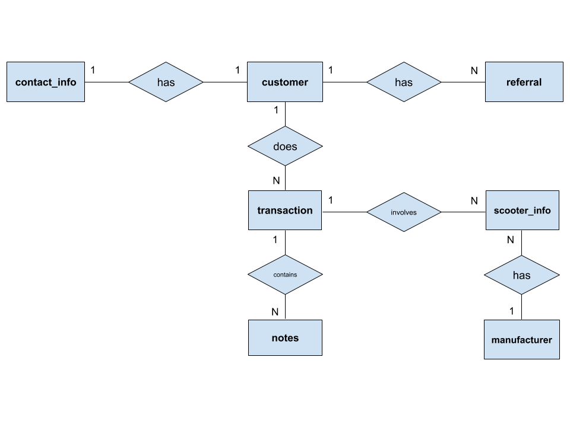
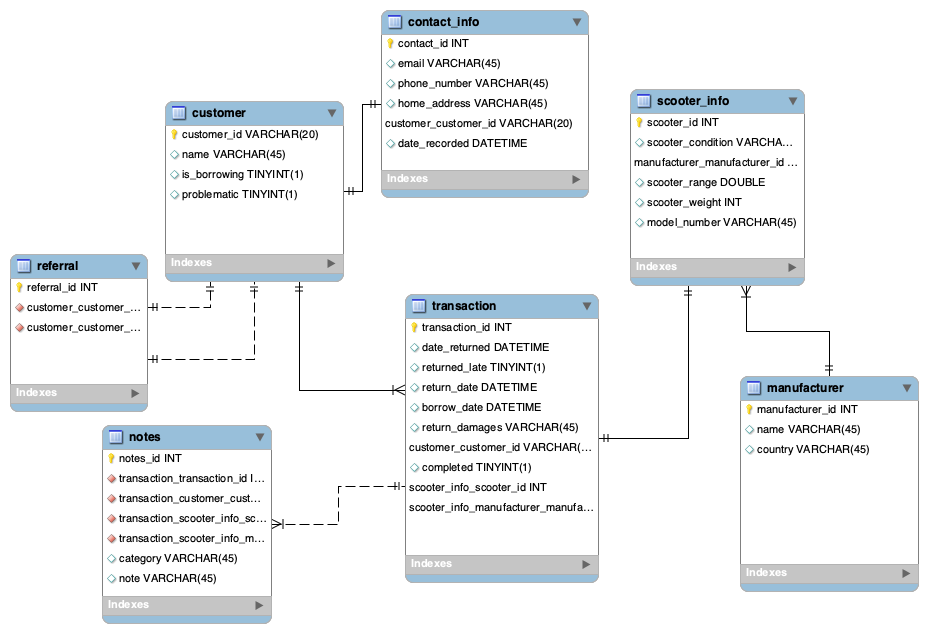

# Homework 6

## Part 1 - Database Design Notes
### Chen Style ER Diagram

### ER Diagram on SQL Workbench

### Design Decisions

We start off with the customer table where we store the data for each person who borrows a scooter. The table for each customer notes down the name of the customer. The contact information for each customer is also taken and stored in a table called the 'contact_info'. The customer table also checks whether they already are borrowing a scooter so they cannot borrow it again. 

To cater to the referrals, there is a 'referrals' table which stores the data for each customer in a one to many relationship where one customer can have multiple referrals by different customers and has two foreign keys from the same customer table in order to ensure that the customer referring and the customer that is referred are present in the table.

Each customer is not linked to a transaction table where there is data stored for each time they have borrowed a scooter, with the data having the date the cycle was borrowed, supposed to be returned, and actually returned. It also flags each transaction to check if that specific borrowal had a late return.

The transaction table is now linked to the scooter_info table which stores the data for all the scooters and is linked to a one to one relationship since each transaction (or borrowal) can only have one scooter in it. The transaction is also flagged as completed for easier access to previous transactions that have the scooter as returned.

The notes table has a weak relationship with the transaction table where a transaction could possibly have a note storing the information about each transaction in multiple categories for each transaction, allowing a one to many relationship.

The scooter_info stores the relevant information for each scooter and is linked to a manufacturer table which has the number of manufacturer in the database from which possible cycles can be borrowed. It is a one to many relationship with the manufacturer table where one manufacturer could possibly have multiple scooters.

## Part 2 - Data Source Documentation 

### About the Data

1. Title: Crime in Context, 1975-2015.

2. Link to Data: https://www.kaggle.com/shivamb/netflix-shows/metadata

3. Source / Origin: 
    * Author or Creator: Shivam Bansal
    * Publication Date: 2019-12-04
    * Publisher: Shivam Bansal
    * Version or Data Accessed: Version 3 (10th November 2020)
    
4. License: CC0 1.0 Universal (CC0 1.0) Public Domain Dedication

5. Can You Use this Data Set for Your Intended Use Case? 
Yes, since I am not reproducing the data and only performing an analysis on it, adhering similarly to the data set that we used in workshop 2.

### Format

### Overview

Format: csv
Size: 2.4MB
Number of Records: 6235

### Sample of Data

show_id    type    title    director    cast    country    date_added    release_year    rating    duration    listed_in    description
81145628    Movie    Norm of the North: King Sized Adventure    Richard Finn, Tim Maltby    Alan Marriott, Andrew Toth, Brian Dobson, Cole Howard, Jennifer Cameron, Jonathan Holmes, Lee Tockar, Lisa Durupt, Maya Kay, Michael Dobson    United States, India, South Korea, China    September 9, 2019    2019    TV-PG    90 min    Children & Family Movies, Comedies    Before planning an awesome wedding for his grandfather, a polar bear king must take back a stolen artifact from an evil archaeologist first.
80117401    Movie    Jandino: Whatever it Takes        Jandino Asporaat    United Kingdom    September 9, 2016    2016    TV-MA    94 min    Stand-Up Comedy    Jandino Asporaat riffs on the challenges of raising kids and serenades the audience with a rousing rendition of "Sex on Fire" in his comedy show.
70234439    TV Show    Transformers Prime        Peter Cullen, Sumalee Montano, Frank Welker, Jeffrey Combs, Kevin Michael Richardson, Tania Gunadi, Josh Keaton, Steve Blum, Andy Pessoa, Ernie Hudson, Daran Norris, Will Friedle    United States    September 8, 2018    2013    TV-Y7-FV    1 Season    Kids' TV    With the help of three human allies, the Autobots once again protect Earth from the onslaught of the Decepticons and their leader, Megatron.
80058654    TV Show    Transformers: Robots in Disguise        Will Friedle, Darren Criss, Constance Zimmer, Khary Payton, Mitchell Whitfield, Stuart Allan, Ted McGinley, Peter Cullen    United States    September 8, 2018    2016    TV-Y7    1 Season    Kids' TV    When a prison ship crash unleashes hundreds of Decepticons on Earth, Bumblebee leads a new Autobot force to protect humankind.

### Fields or Column Headers

* Field/Column 1: Name = show_id, Type = integer.
* Field/Column 2: Name = type, Type = string.
* Field/Column 3: Name = title, Type = string.
* Field/Column 4: Name = director, Type = integer.
* Field/Column 5: Name = cast, Type = integer.
* Field/Column 6: Name = country, Type = integer.
* Field/Column 7: Name = date_added, Type = date.
* Field/Column 8: Name = release_year, Type = int.
* Field/Column 9: Name = rating, Type = string.
* Field/Column 10: Name = duration, Type = string.
* Field/Column 11: Name = listed_in, Type = string.
* Field/Column 12: Name = description, Type = string.

